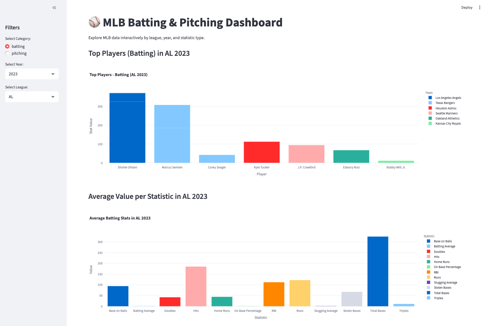

# ⚾ Web Scraping of MLB Statistics & Dashboard
## Project Overview

This project demonstrates web scraping, cleaning, analysis, and creating a dashboard using Streamlit on collected MLB data for 2023–2024.
It explores Major League Baseball (MLB) player and team performance through web scraping, analysis, and interactive visualization.

## Steps

* Web Scraping: Collected MLB player batting and pitching statistics for 2023 and 2024 seasons.

* Data cleaning: Removed duplicate rows, dropped unnecessary columns, renamed columns, converted the Value column to numeric, etc.

* Database: Created batting_pitching SQLite database and organized data into separate tables (e.g., batting_2023_AL, pitching_2024_NL).

* Query Program: Allows users to run queries for top home run hitters by year and league, compare team batting statistics, and view league summaries.

* Streamlit Dashboard: Visualizes MLB data interactively to explore league trends and player performance.

## Dashboard Features

* Filters:

    * Year (2023 or 2024)

    * Statistic (Home Runs, Batting Average, RBI, etc.)

    * Team or League

* Visualizations:

    * Top Players by Statistic: Displays top-performing players for a selected metric and season.

    * League Comparison: Compares average values of key stats between the American League (AL) and National League (NL).

    * League Trend (2023–2024): Shows how AL and NL performance changed across the two seasons.

## Setup Instructions

#### Environment

Recommended Python version: 3.10+

#### Dependencies

Install required packages:

pip install pandas plotly streamlit sqlite3

#### Run the Dashboard

From your project folder:

streamlit run src/5_dashboard.py

Then open your browser at:

http://localhost:8501

#### Screenshot

## Author

Tatiana Snook

Web Scraping and Dashboard Project for Code The Dream class - Python 100
